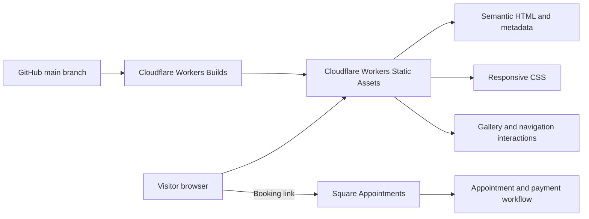
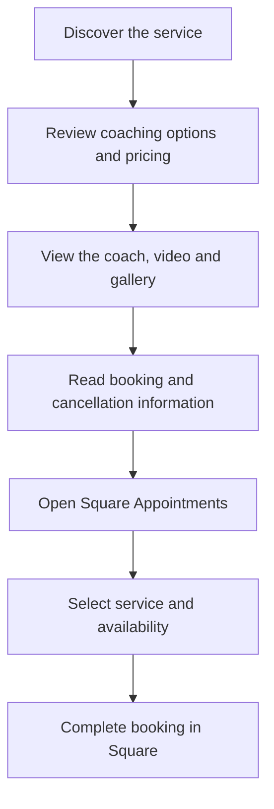

# Coaching by Manav

**A responsive business website · HTML, CSS, JavaScript and Cloudflare Workers**

A website for a personal training and accountability-coaching service. It explains the offering, presents the coach and guides visitors to Square Appointments to book. I built the front end with plain HTML, CSS and JavaScript, including an interactive gallery and responsive layouts.

**[Visit the live website](https://coachingbymanav.com.au)** · [Architecture notes](docs/architecture.md) · [Zain's portfolio](https://github.com/khokharzain)

## What visitors can do

- Explore coaching services, pricing and booking information.
- Browse a looping photo gallery with keyboard, swipe and pause controls.
- Watch an introduction video and navigate directly between page sections.
- Open Square Appointments to select a service and available time.

## Architecture



The site serves static assets. Square handles appointment booking and payment; this repository does not implement a custom payment backend or store card details.

## Visitor flow



## Engineering decisions

| Decision | Reason and implementation |
| --- | --- |
| No application framework | The content is known at author time; browser APIs support the required interactions without a framework dependency tree |
| One gallery scroll container | Animation frames, duplicated slides and carried fractional movement support looping motion; buttons, keyboard and swipe share the same container |
| Visitor controls for motion | A pause control and reduced-motion preference govern automatic gallery movement |
| Progressive scroll feedback | CSS scroll timelines are used where supported, with an animation-frame JavaScript fallback |
| Semantic sections and sticky navigation | Anchor links, scroll margins and active-section feedback keep a long page easy to navigate |
| Search and sharing metadata | Canonical URL, social cards, structured data, robots.txt and sitemap.xml describe the business site |
| Documentation excluded from deployment | .assetsignore keeps Markdown, configuration and development artefacts out of the static asset upload |

## Run locally

Requirements: Git and Python 3 (or another static HTTP server). There is no dependency installation or build step for the page.

```bash
git clone https://github.com/khokharzain/coaching-by-manav.git
cd coaching-by-manav
python3 -m http.server 5500
```

Open [http://localhost:5500](http://localhost:5500).

## Source guide

```text
index.html          page sections, metadata and booking link
css/styles.css      design tokens, layout, responsive styles and motion
js/script.js        gallery, video, navigation and scroll feedback
images/             page imagery, gallery and social-preview assets
video/              introduction video
wrangler.jsonc      Cloudflare static-assets configuration
.assetsignore       files excluded from the deployed site
docs/               architecture, detailed notes and booking documentation
```

## Check changes

There is no automated browser test suite. For front-end changes, check narrow and wide layouts, keyboard navigation, gallery pause/resume, reduced motion, sticky-header anchor offsets and the Square booking destination. A local preview does not prove that a live appointment or payment succeeds.

Cloudflare Workers Builds is configured to deploy from main. This documentation update changes no page code or booking configuration.

## More detail

- [Architecture and interaction design](docs/architecture.md)
- [Detailed implementation and deployment notes](docs/implementation-notes.md)
- [Square setup status](docs/square-setup-status.md) — dated configuration notes; check the current booking provider before relying on operational details
- [Cancellation policy notes](docs/cancellation-policy.md)
