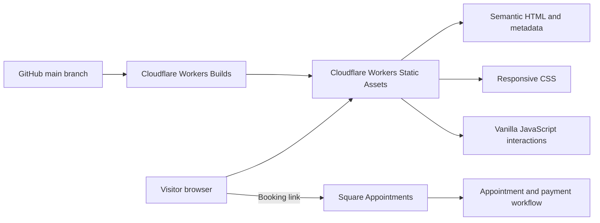
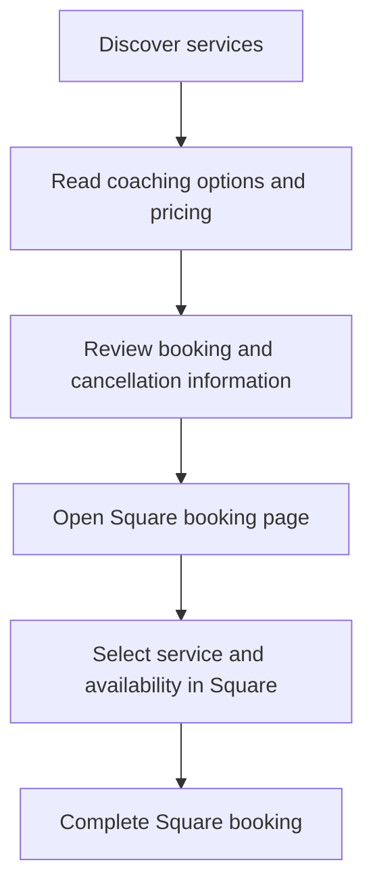

# Architecture and visitor flow

Coaching by Manav is a static business website. It presents the service and sends visitors to Square Appointments to choose appointments and complete booking/payment steps. It does not implement an in-house payment API or store customer/card data.

## System boundary

## Visitor journey

## Front-end engineering

- **Gallery:** `js/script.js` advances a real scroll container with `requestAnimationFrame`; duplicated slides allow its scroll position to wrap. Arrow, keyboard and pointer/touch interactions share the same container. Fractional movement is carried between frames.
- **Motion controls:** a pause button and reduced-motion preference prevent visitors from being forced to watch automatic movement.
- **Progress indicator:** CSS scroll timelines are used when available; the JavaScript fallback batches updates into animation frames.
- **Navigation:** section anchors, scroll margins and an intersection observer support sticky navigation and active-section feedback.
- **Search metadata:** canonical URL, social cards, LocalBusiness structured data, `robots.txt` and `sitemap.xml` describe the site.
- **Deployment:** `wrangler.jsonc` describes static assets and custom domains; `.assetsignore` excludes documentation/configuration from deployed assets.

## Check changes

Serve the repository over HTTP, then check desktop and mobile widths, keyboard navigation, gallery pause/resume, reduced motion, anchor offsets and the destination of the booking link. Documentation-only changes do not alter visitor behaviour.

There is no automated browser test suite in this repository. Do not treat a feature description as evidence of a passed accessibility or performance audit.
